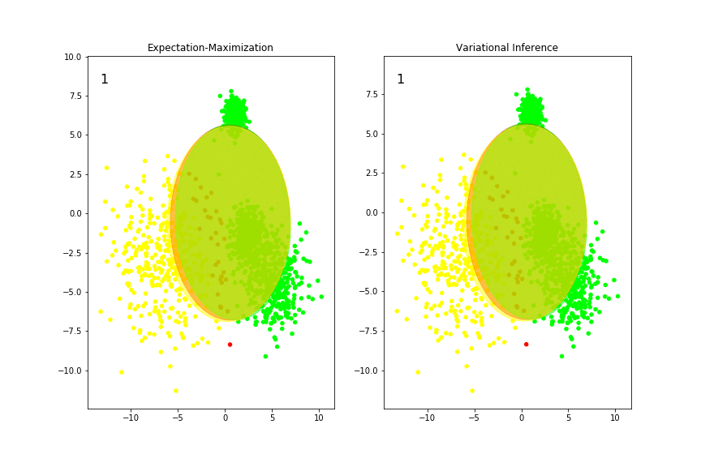

# ML\_compare\_mixture\_algs

**Goal:** Compare expectation maximization (EM) and variational inference for mixture of Gaussians.

## View animated example

Using the settings: ```n_components = 5, weight_concentration_prior = 1e-3```, creates this animation comparing EM and variational inference for mixture of Gaussians:



Check out the whole Jupyter Notebook here: [https://abegehr.github.io/ML_compare_mixture_algs/](https://abegehr.github.io/ML_compare_mixture_algs/)

… and then run your own experiments!

## Run your own experiments:

1. Clone or download this repository.
2. Navigate to folder: ```cd (path to)/ML_compare_mixture_algs/```
3. Start jupyter notebook: ```jupyter notebook```
4. Webbrowser with jupyter notebooks running opens.
5. Open ```main.ipynb``` in jupyter notebooks.
6. Run all cells.
7. Animations comparing expectation maximization (EM) and variational inference applied on a mixture of Gaussians are shown. Great!
8. Change parameters to test the two methods. Use the settings in the second to last cell to change parameter settings under ```# PARAMETER SETTINGS HERE```. For example, try these settings:
	* ```n_components = 4, weight_concentration_prior = 1e-3```
	* ```n_components = 5, weight_concentration_prior = 1e-3```
	* ```n_components = 8, weight_concentration_prior = 1e-3```
	* ```n_components = 5, weight_concentration_prior = 1e+3```
9. It is possible to experiment with many more parameters. Find the ```sklearn``` documentation for more information on possible parameters here:
	* Expectation Maximization (EM) for mixture of Gaussians: [sklearn.mixture.GaussianMixture](http://scikit-learn.org/stable/modules/generated/sklearn.mixture.GaussianMixture.html)
	* Variational Inference for mixture of Gaussians: [sklearn.mixture.BayesianGaussianMixture](http://scikit-learn.org/stable/modules/generated/sklearn.mixture.BayesianGaussianMixture.html)
10. Happy experimenting!

---

This animation was created as part of the seminar [_Mathematics of machine learning_](https://www.mi.fu-berlin.de/en/math/groups/hysteresis/teaching/machine-learning3.html) SS2018 ([PD Dr. Pavel Gurevich](https://www.mi.fu-berlin.de/en/math/groups/hysteresis/members/projectleader/gurevich.html)). Group #6.

If you have any comments or questions, please contact: [a.begehr@fu-berlin.de](mailto:a.begehr@fu-berlin.de)
